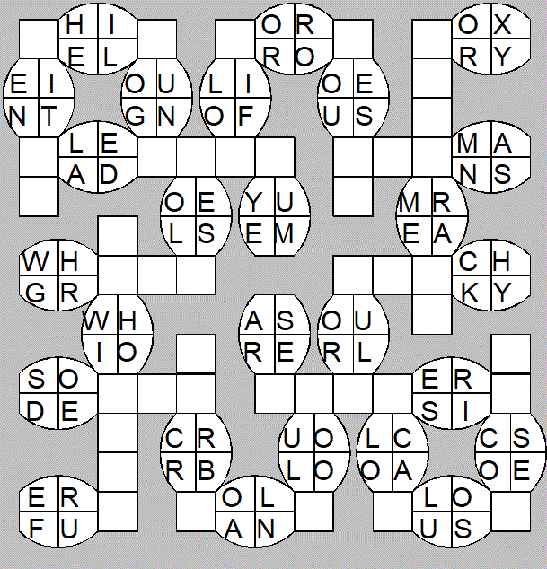

\par \textbf{Keywords}: crosswords, split decisions, computational linguistics

Code available on [GitHub (link)](https://github.com/oliver-daniel/inf_313_final_paper).
```{r setup, echo=FALSE}
knitr::opts_chunk$set(
    echo = FALSE, warning = FALSE, cache = TRUE,
    out.width = "100%", out.align = "center", dir
)
options(knitr.graphics.error = FALSE)
```

```{r libraries, include=FALSE}
if (!require(tidyverse)) {
    install.packages("tidyverse")
}
if (!require(kableExtra)) {
    install.packages("kableExtra")
}

library(tidyverse)
library(knitr) # TODO CITE
library(kableExtra) # TODO CITE
```

\tableofcontents

## Introduction
<!-- TODO: "in this paper..." -->
### About Split Decisions
A few times a year, the New York Times games department releases a new issue of a word puzzle called Split Decisions. Similar to crosswords, the game board consists of boxes arranged in sequence, one for each letter of a word running either left-to-right or top-to-bottom, intersecting with other words at right angles, as shown below in Figure \ref{fig:example-puzzle}. The Split Decisions website [@split-decisions] attributes the original puzzle format to the late George Bredehorn; after his death, the mantle was taken up by Fred Piscop, whose puzzles appear in the *Times* to this day.

<!--  -->
```{r example-puzzle, fig.cap="\\label{fig:example-puzzle}An example Split Decisions puzzle from Piscop's website."}

```

Evidently, instead of cryptic descriptions of correct answers, Split Decisions solvers are only given pairs of two-letter substrings for each word. The remaining boxes, each containing one letter as in a typical crossword, combine with either of these substrings to form an English word. For example, the top-rightmost word, spelled horizontally ("across"), could take a P in its singular empty box to form the words POX and PRY, or an F to form FOX and FRY, potentially among other combinations. However, in filling out the rest of the puzzle, it becomes evident that only the latter solution accommodates both the across word pair, and the down pair that intersects it. 

### Rules, Notation and Terminology
In order to analyze different aspects of the game, we must first lay out a few rules of how Split Decisions puzzles work in general, as well as some additional constraints we introduce for the purpose of study. Additionally, we lay out some notation and terminology we will use to succinctly describe different segments of a puzzle word.

For lack of a robust \LaTeX mechanism for creating authentic-looking Split Decisions clues, like in Figure \ref{fig:example-puzzle}, we will use simpler notation to represent word pairs. Firstly, we will largely use underscores to represent those boxes left unfilled by the puzzle setter, and some visual delineator (often vertical alignment or slashes) to represent the provided two-letter substrings. For certain purposes, we may use a full equation-level \LaTeX environment, like:

$${PL \choose GR} \_\ \_\ \_\ \_$$

But, the above pair may also more succintly be represented in-text by a form like (PL/GR)\_\_\_\_ when more appropriate.

A correct fill for the remaining boxes might be (PL/GR)EASE, creating both PLEASE and GREASE, or as __EASE when the two missing letters are inessential. For the remainder of this paper, such a pair of words will be referred to as a *word pair*, sharing a *common substring*[^1] and differing by a *split pair*. The common substring and split pair meet at *boundaries*: using the convention of left-to-right for English, we might describe the above diagram as possessing a *right boundary*, but lacking a left one (as the split begins the word). In the (PL/GR)EASE notation used above, this right boundary is represented by the concatenation of the right parenthesis with another letter. In general, the shorthands *prefix* and *suffix* will be used to refer to common fill before the left boundary and after the right, respectively. Returning to the above example once more, (PL/GR)EASE lacks a prefix and has a suffix of "EASE".

Note that each clued split pair might accept several different fills for the common substring, e.g., (PL/GR)UNGE (PLUNGE, GRUNGE); however, as with crosswords, only one solution will also satisfy all the crossing constraints produced by the rest of the puzzle. 

Although a letter may appear on both sides of a split, say, (IT/TA), the letter will *never* appear at the same index in both words, e.g., (IT/AT), as such a pair of words would only differ by a single letter instead of two. Also, although such a puzzle would be fascinating to both solve and analyze, crossing words do *not* go through split pairs, only common letters.

Finally, although a word pair can theoretically be as short as three letters, this paper examines only pairs of length five and above.

Upon understanding the rules of the puzzle, one may start to wonder: what sorts of words form split pairs? Are some splits more common than others? How do the properties of English, as both a spoken and written language, affect the guessability of a given split pair? In this paper, we perform preliminary statistical analysis to investigate these questions, using a variety of computational methods.


## Data
### Corpora: What's a "word"?
One of the most common side effects of continued study in linguistics is a diminished ability to describe what defines a "word". For the purpose of this study, we have taken three lists that purport to contain a wide variety of English words, though certainly not their totality, and used them to generate all possible combinations that produce a valid Split Decisions word pair (in terms of a two-character split pair, etc.). As a result, many entries that appear in one or more of these corpora may seem esoteric, or even offensive, to be cosnidered as words; however, the only predicate for their inclusion in these lists is attested usage, not whether they prescriptively *ought* to be a word. Words appear in these corpora in lexicographical order (i.e., sorted alphabetically), one on each line, in lower-case letters.

The first and smallest corpus comes from an open-source distribution of GNU/Linux, specifically Ubuntu. For brevity, I will usually refer to this corpus as `linux` (note the lower-case letters and monospace font). This corpus, developed over time by online contributors through the development of Ubuntu, is accessed on Linux machines through the symbolic link `/usr/share/dict/words`. It is primarily used as a baseline for other text processing programs' spell-checking and text prediction functionalities.

The `collins` corpus [@collins] is privately produced by HarperCollins LLC, a publishing company well known for producing English- and multiple-language dictionaries. This dictionary in particular finds notable use in competitive Scrabble play: competitors in so-called 'Collins divisions' at tournaments will study from and refer to this list as the superset of all playable Scrabble words.

Similarly, the `nwl` corpus [@nwl2020] was produced directly by members of the North American Scrabble Association (NASPA) for the purpose of tournament play. In Canada and the United States, this word list serves as the *de facto* standard for competitive Scrabble, and is usually the default wordlist unless another is specified, as in the aforementioned Collins divisions.

```{r read-data}
corpus.linux <- read.table("in/corpus/linux.txt")
corpus.collins <- read.table("in/corpus/collins.txt")
corpus.nwl <- read.table("in/corpus/NWL2020.txt")

dat.linux <-
    read.csv("in/cache/linux.csv") |>
    tibble() |>
    mutate(
        corpus = "linux",
    )

dat.collins <-
    read.csv("in/cache/collins.csv") |>
    tibble() |>
    mutate(
        corpus = "collins",
        start = start + 1, # Made this column zero-indexed by accident :)
        end = end + 1
    )

dat.nwl <-
    read.csv("in/cache/NWL2020.csv") |>
    tibble() |>
    mutate(corpus = "nwl")

dat.all <- function() {
    rbind(
        dat.linux,
        dat.collins,
        dat.nwl
    )
}
```

```{r}
most_common <- function(col, n = 1) {
    table(col) |>
        sort() |>
        names() |>
        tail(n)
}

PATTERN <- "[a-z]{5,}"

corpus_stats <- rbind(
    tibble(
        corpus = "linux",
        all_words = corpus.linux |> nrow(),
        valid_words = corpus.linux |>
            filter(str_detect(V1, PATTERN)) |>
            nrow(),
        pairs_count = dat.linux |> nrow()
    ),
    tibble(
        corpus = "collins",
        all_words = corpus.collins |> nrow(),
        valid_words = corpus.collins |>
            filter(str_detect(V1, PATTERN)) |>
            nrow(),
        pairs_count = dat.collins |> nrow()
    ),
    tibble(
        corpus = "nwl",
        all_words = corpus.nwl |> nrow(),
        valid_words = corpus.nwl |>
            filter(str_detect(V1, PATTERN)) |>
            nrow(),
        pairs_count = dat.nwl |> nrow()
    )
)

split_pair_counts <- dat.all() |>
    mutate(split_pair = paste0(split_x, "/", split_y)) |>
    group_by(corpus) |>
    count(split_pair, name = "split_pair_count") |>
    slice_max(n = 1, order_by = split_pair_count, with_ties = F)


split_x_counts <- dat.all() |>
    group_by(corpus) |>
    count(split_x, name = "split_x_count") |>
    slice_max(n = 1, order_by = split_x_count, with_ties = F)

split_y_counts <- dat.all() |>
    group_by(corpus) |>
    count(split_y, name = "split_y_count") |>
    slice_max(n = 1, order_by = split_y_count, with_ties = F)
```

```{r corpus-stats"}
corpus_stats |>
    left_join(split_x_counts, by = "corpus") |>
    left_join(split_y_counts, by = "corpus") |>
    left_join(split_pair_counts, by = "corpus") |>
    mutate(
        split_x = paste0(split_x, " (", split_x_count, ")"),
        split_y = paste0(split_y, " (", split_y_count, ")"),
        split_pair = paste0(split_pair, " (", split_pair_count, ")")
    ) |>
    select(
        corpus, all_words,
        valid_words, pairs_count, split_x,
        split_y, split_pair
    ) |>
    kable(
        booktabs = F,
        col.names = c(
            "Corpus", "Total",
            "Valid", "Total", "First split",
            "Second split", "Split pair"
        ),
        caption = "Post-processing statistics for each corpus of English words."
    ) |>
    kable_classic(latex_options = "hold_position") |>
    add_header_above(c(" " = 1, "Words" = 2, "Word pairs" = 1, "Most frequent (occurrences)" = 3))
```

### Processing & Caching
The algorithm for determining whether two strings of the same length form a Split Decisions pair is quite simple.

1. Traverse the indices of both strings, comparing their characters pairwise. That is, compare the first letters of both strings, then the second, and so on.
2. Record each index at which the two characters differ.
3. Once traversal is complete, if there are exactly two differences and they differ in index by exactly one, then the two strings form a word pair. Otherwise, continue with another combination of strings.

However, initial experiments with identifying these word pairs directly in R proved to be untenably slow. Since every word in a corpus has to be compared to every other word of the same length at least once, any algorithm[^2] used to do so cannot run in better than quadratic time, and even R packages with bindings to C took several hours to run on even the smallest of the corpora. Instead, a Python script was written to process the words more efficiently, and then write the results in a CSV file that could be more readily imported into the R environment. This precomputation phase significantly reduced start-up time when creating R sessions to author this paper, or to knit this document into a PDF. A link to the script can be found in the Appendix.

### Variables
These cached CSVs accounted for the following variables of each word pair:

1. `length`: the length of each word in the pair. Ranges from 5 to 21.
2. `x`: the lexicographically-first full word in the pair, with no additional notation for the split or any boundaries.
3. `y`: the lexicographically-second full word in the pair.
4. `start`: the 1-index of the beginning of the split. For example, a split at the beginning of a word would have value 1.
5. `end`: The 1-index of the end of the split. This is a convenience variable: each split has a length of exactly two, and hence the ending index is always equal to `start + 1`.
6. `split_x`: The lexicographically-first of the two splits. As a property, the `start`th to `end`th substring of `x` is always this value.
7. `split_y`: The lexicographically-second of the two splits, as above.
8. `corpus`: The corpus from which this pair was determined. One of `linux`, `collins`, or `nwl`.

In certain context-specific scenarios, other variables are computed:

9. `type`: divides each word pair into one of three categories, depending on the positioning of its split pair. If the split pair is at the beginning of the word, the type is "prefix"; if at the end, "suffix"; and otherwise, "middle". (PL/GR)EASE is a "prefix"-type pair, for example.
10. `rank`: when comparing different pairs, splits, etc. by their frequency, a ranking variable is introduced to keep track of which is the most frequent, the second most frequent, and so on.
<!-- TODO -->

Figure \ref{fig:split-violins}, below, demonstrates the distribution of these different split types across word pairs of different corpora and lengths. For example, 15-letter word pairs from the `linux` corpus (in green) overwhelmingly favour suffix-type splits.
```{r split-violins, fig.cap="\\label{fig:split-violins}Width at a particular y-value represents the density of splits in word pairs of a given length, starting at that index."}
dat.all() |>
    filter(length <= 15) |>
    ggplot(aes(
        x = factor(length),
        y = start,
        color = corpus
    )) +
    geom_violin(scale = "width") +
    facet_wrap(~corpus, dir = "v") +
    scale_y_continuous(breaks = c(2, 4, 6, 8, 10, 12, 14, 16)) +
    labs(
        title = str_wrap("Proportional distribution of split pair indices across corpus and pair length", 60),
        x = "Length (in letters)",
        y = "Starting 1-index of splits",
    ) +
    theme(
        legend.position = "none"
    )
```

As discussed later in **Results**, we hypothesize that the gobelet-like shape seen above in longer words (e.g., 9+ letters) is due to a wide variety of verbal stems that differ only in their declension, as indicated by a suffix (e.g., participating, participation).

## Results

## Discussion

\newpage
## Appendix
<!-- TODO: python script -->
### Link to Python preprocessing script
Found in the [GitHub repo](https://github.com/oliver-daniel/inf_313_final_paper/blob/main/scripts/find_pairs.py).

\newpage
## References


<!-- Footnotes -->
[^1]: Or *fill*: this part of the puzzle is filled in by the player rather than the constructor.
[^2]: i.e., any naive iterative algorithm.